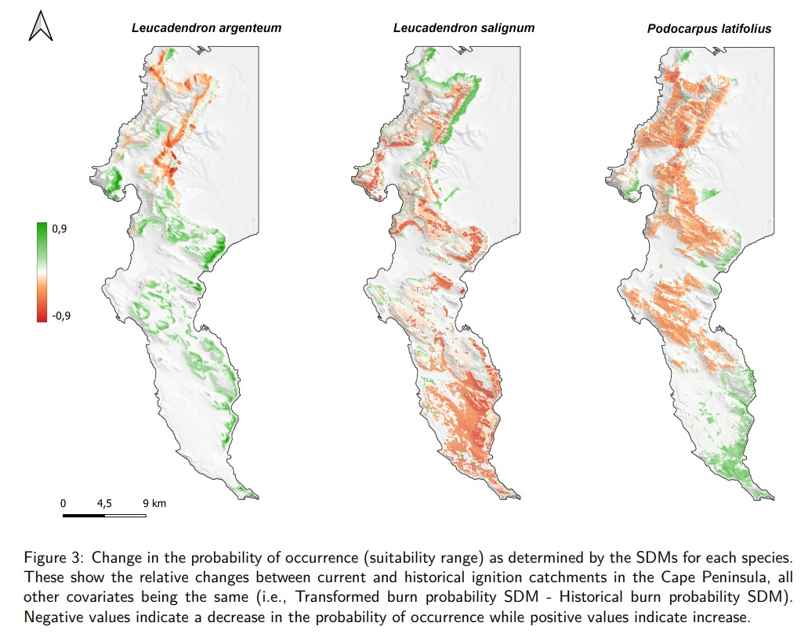

## About this project

### Brief: Altered ignition catchments and the fate of fire-dependent species

The Cape Peninsula is one of the most botanically diverse landscapes in the world, supporting ~2500 plant species. Many of these species require fire to complete their life-cycle, creating a dependence on fire for their long-term persistence (Magadzire *et al.* 2019). The Peninsula also hosts a city of ~4 million people, who are both sources of and potential victims of wildfire. Human activities intentionally or unintentionally alter various drivers of the fire regime, such as fuel structure and continuity, or the number, location and timing of ignitions. This alters the natural fire regime, creating conditions that may no longer be favorable for the persistence of fire-dependent species and ecosystems. We need to better understand the implications of altered fire regimes for species and ecosystems so that we may inform fire management practices for improved conservation outcomes, in addition to reducing risk to life and property.

Previously, we used mechanistic fire-spread models to explore the impact of anthropogenic land cover change on the spatial probability of fire occurrence (burn probability) across the Cape Peninsula (Slingsby *et al.* 2020). To do this we developed and compared spatial estimates of the burn probability with and without human influence on land cover. For this assignment we will use species distribution models and spatial statistics to explore the dependence of species and ecosystems on the fire regime, and to project how their distributions may be affected as fire regimes change. If things go well, we may use this information to explore trade-offs and synergies with fire management practices aimed at risk reduction.

### My approach

In this research exercise, I use a machine-learning spatial correlation model (MaxEnt) to investigate the changes in habitat suitability since historical times for three plant species that each occupy particular environments in the Cape peninsula. These plant species depend on fire in their own respective ways, and ignition catchment changes would therefore have some specific effect on the habitat suitability of a given species. I model the species distribution for each of these species both historically and currently in the absence of climate-related predictors, in the presence of terrain-related predictors alongside the ignition catchment data. 

## The result

In my final submission (a journal-styled article), I report the main result in the form of a static GIS map:

However, this result depends on a collection of other important results and assumptions discussed in the report. 

## If youre interested...

You can [view the paper here](https://github.com/ZackaryPryde/Project_1/blob/322fe8061b41312c792b2d378c06b60518496eb4/PRYZAC001.pdf).

