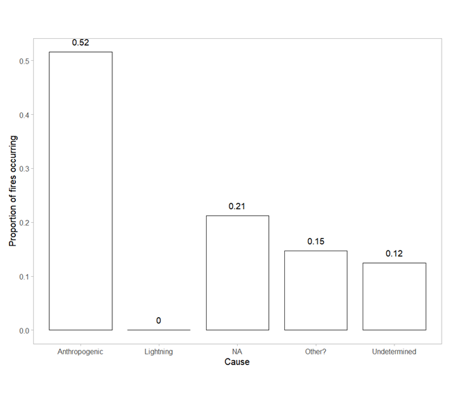

## About this project

### Brief

Increasing fire frequency and intensity globally has been commonly attributed to climate change. Last year, Cape Town went through a devastating fire with much damage to UCT. In this essay we will consider the drivers of changes in global and regional fires and attempt to evaluate the role of climate change. Fires depend on a number of factors, including temperature, wind, vegetation and soil moisture and the vegetation characteristics. Climate change (increasing temperature and aridity) is thought to enhance the drying of organic matter and promote fire, but there are other changes in climate and vegetation that need to be considered.

### My approach

My evaluation of this topic specifically focuses on the wildfire patterns in the Fynbos biome of South Africa. This is one of the most scientifically renowned fire-prone landscapes, much of its popularity owing to its incredible floristic biodiversity with many plants occurring nowhere else in the world. With increasing urbanization of this Mediterranean-type region, we should recognize the roles that humans play in regulating fire in an otherwise fire-prone landscape as such. How do humans affect wildfire patterns under a climate change? I attempt to answer this question among others below.  

## Introduction

Wildfire patterns have been changing over time, and in recent years scientists have investigated the idea of increases or decreases in fire frequency, extent, and intensity around the world (i.e., Doerr and Santin, 2016; Rao et al. 2022; Di Virgilio et al. 2019). These  changes are commonly attributed to climate change (Rao et al. 2022; Di Virgilio et al. 2019), however, there are various lines of evidence in the literature that highlight global and regional-scale drivers of wildfire change that are otherwise less commonly addressed. The anthropogenic control of fire incidence, including suppression, increased ignition, and the consequent implicit effects on fire-prone plant communities need to be considered if we want to understand the effects of global change on wildfire patterns going forward.

Fire is a key disturbance and perpetual feature of many terrestrial ecosystems, which has driven the formation of complex ecosystem relationships and land plant evolution since the Palaeozoic (Pausas and Keeley, 2009; Keeley, 2012). Globally, wildfire has a heterogeneous distribution which is in turn controlled by a set of drivers that can be classified over various levels of complexity (i.e., Figure 1). Flammable ecosystems (i.e., boreal forests, eucalypt woodlands, shrublands, grasslands and savannas) are commonly differentiated in context of fire-regimes - the patterns of frequency, season, type, severity, and extent of fires over time in a landscape – however, syndromes of fire, soils and climate can act synergistically to shape vegetation (Bond and Keeley, 2005; Keeley, 2012). The Fynbos biome of South Africa is one such fire-prone landscape (i.e., shrublands), being one of five Mediterranean-type climate (MTC) regions in the world (Keeley, 2012). MTCs are regions where precipitation exceeds potential evapotranspiration during the rainy season, resulting in sufficient plant growth that becomes highly flammable during the summer dry season (Keeley, 2012).

While the physical process of combustion is simple in theory, its consideration with the relative influence of biotic and abiotic controls on observed, modern fire regimes has become a popular topic in ecological research (Krawchuk et al. 2009). For example, fire as an ecosystem process (Figure 1b) is driven by factors that are all undoubtedly influenced by climate seasonality, however, factors such as ignition source and fuel structure can also be influenced by anthropogenic activity. Various research supports the hypothesis that climate is a primary driver of the interannual variability of fires in MTC ecosystems (Turco et al. 2014), and while some reports predict likely increases in fire frequency under climate change (i.e., Turco et al. 2014), other research suggest that this may not be the general case (i.e., Hoffman et al. 2011). Although  weather conditions influence fire behaviour and the extent to which an area is burnt, the number of fires occurring can be limited by the presence/absence of ignition sources (Kraaij and van Wilgen, 2014). With a predicted growth in human populations in all areas, the number of ignition opportunities and the frequency of fires are expected to increase which may have detrimental consequences for biodiversity conservation, the control of invasive alien species (van Wilgen et al. 2010) and may also indirectly affect future fire regimes in the Fynbos biome. 

Evaluating changes in wildfire patterns requires us to incorporate the roles played by anthropogenic activity with the primary influences of climate change, yet the interaction of fire with such activities remains poorly understood (Aldersley et al. 2011). How does an increase or decrease in anthropogenic-driven ignition opportunities exacerbate effects and changes of wildfire activity in the fynbos biome under climate change? In this research essay, I aim to discuss how modified ignition sources may lead drive altered wildfire activity in the fire-dependent fynbos biome of the Cape Floristic Region (CFR), South Africa.

## How does climate drive wildfire in the Fynbos biome and what can we expect in the future? 

In the Fynbos biome (Figure 2), vegetation are typically fire-adapted and fire-dependent, with properties more or less susceptible to fire, and with mechanisms facilitating post-fire regeneration and succession (Kraaij and van Wilgen, 2014; Keeley, 2012). This vegetation is largely made up of three main types: Fynbos, Renosterveld and Strandveld (Figure 3), often referred to as 'fire-ecology types'. MTC temperature and rainfall seasonality strongly influences when and how vegetation may burn by directly controlling fuel structure and fuel moisture. Specifically, the presence, amount, and connectivity of fuel (fuel structure) influences the extent and spread of a fire given an ignition source, while fuel moisture influences how likely an ignition may be (fuel flammability)(Kraaij and van Wilgen, 2014; Turco et al. 2014). The structure and composition of any given Fynbos plant community (fuel type) is closely related to the fire regime (Pooley 2012). Furthermore, topographic features and fuel types interact with weather conditions (particularly prevailing winds) and ignition sources to determine the spread of fire through these landscapes (Slingsby et al. 2020).

Fire danger classification systems are often used to quantify the likeliness of fire ignition and spread - in the form of a Fire Danger Index (FDI) - with respect to weather variables (typically measured daily) such as maximum temperature and minimum relative humidity, wind speed, the time since last rain fell, and moisture deficit (Kraaij, Cowling, and van Wilgen, 2013; van Wilgen et al. 2010). A commonly used FDI in research, for example, is the McArthur Forest Fire Danger model (Noble et al. 1980). Hot, dry, and windy conditions are associated with high fire danger (typical summer days in MTCs). Although the FDI is a useful tool, it is important to note that its definition originated in context of Northern Hemisphere systems and has not been extensively checked for Southern Hemisphere systems. However, the McArthur fire-danger model is perhaps particularly useful in MTC weather as it incorporates the Keetch–Byram drought index, which may also be used as a stand-alone index to measure the effect of seasonal drought on fire potential (Kraaij, Cowling, and van Wilgen, 2013). In a case study from the Cape fynbos, van Wilgen et al. (2010) noted that fires take place under a range of weather conditions but showed that fires of large size are often associated with high to very high FDI values. Despite this finding, they suggest that the overall incidence of fire is limited by the frequency of ignition sources. 

Lightning strikes are a frequently used example of a natural ignition source and would likely have been the primary source of wildfire ignition in a pre-human era (Kraaij and van Wilgen, 2014). Kraaij, Cowling, and van Wilgen (2013) were the first to conduct a detailed study on lightning occurrence in the Fynbos and found that the density of lightning in the eastern coastal zone was higher than in the western coastal zone with an increase towards the interior of the CFR, but that lighting seasonality was similar across the west-to-east gradient. Although lightning has been reported as an ignition source throughout the CFR, not much is known about the spatiotemporal variation in lightning incidence (Keeley, 2012). Generally, lightning ground strikes seldom result in an ignition because fire incidence and peak lightning seasons are uncorrelated in southern African biomes, and most lightning occurs in humid conditions which impedes fire spread (Kraaij and van Wilgen, 2014).

There have been several attempts to predict future climate scenarios in the Western Cape, and there seems to be plenty disagreement in the literature and based on different data sources (i.e., Midgley et al. 2005 Vs Hoffman et al. 2011). Some research reports that projections of climate in the CFR suggest much of the landscape will become hotter and drier, which could be associated with likely increases in fire frequency (Kraaij and van Wilgen, 2014; Wilson et al. 2010; Midgley et al. 2005), while others have suggested otherwise through additions of less commonly used climate factors. For example, in a retrospective analysis of the changes in meteorological variables (notably pan evaporation and wind run) in the CFR to determine their direction and rate of change over the 1974-2005 period, Hoffman et al. (2011) reported a steady, significant increase in maximum temperature and Vapour Pressure Deficit (VPD), accompanied by large decreases in pan evaporation and wind run. These authors note that although temperatures may continue to rise, a decrease in pan evaporation and wind run could ultimately decrease evaporative demand on vegetation and limit fire spread, consequently decreasing FDI and ameliorating fire risk in the future. The implications of climate change on wildfire in the CFR are seemingly unclear and remains a topic that requires further attention.

## Anthropogenic drivers and intervention: Good, Bad, or Neutral? 

In the CFR, fire cause is seldom known. Fynbos fire regimes are generally dominated by unplanned fires, which constitute roughly 90% of the collective area burnt (van Wilgen et al. 2010 as cited in Kraaij and van Wilgen, 2014). Although lightning-ignited fires often drive the fire regimes of some remote mountain catchments (E.g., the Swartberg Mountains), anthropogenic ignitions are more substantial in densely settled areas (Kraaij and van Wilgen, 2014). Perhaps anthropogenic climate change may cause changes in lightning ignitions; however, I only consider direct anthropogenic ignition sources in this section. 

Identifying and/or quantifying the sources and nature of an ignition in the Western Cape is difficult because this task often relies on poor quality government data, which is perhaps one of the only sources that provide details regarding the cause and description of any given fire incident. The Western Cape Government open data portal provides data for all fire incidents reported to local fire departments between the years 2009 and 2016 (including those that did not result in subsequent wildfire). For example, simple analyses of two attributes in the dataset (“Incident description” and “suspected cause”) reveals that “Vegetation” fires were the most frequently reported incidents over the period (53%)(Figure 5), while “Anthropogenic” activity was the most frequent suspected cause (52%)(Figure 6). Interestingly, lightning ignition as suspected cause accounts for the least number of fires reported during the period (0% due to rounding)(Figure 6). Notably, the amount of data providing null information (“NA”, “Other”, “Undetermined”) accounts for 17% of all incidents and a large 48% of all suspected causes. Despite the evident “data problem”, anthropogenic ignitions are likely the most common ignition source in the Fynbos, and many researchers have acknowledged this (i.e., Keeley, 2012; Kraaij and van Wilgen, 2014; van Wilgen et al. 2010). Independent data (typically remote sensing) for fires and lightning are becoming increasingly available, which creates potential for nuanced research in this field (i.e., Southey, D, 2009). For example, these data may provide details regarding fire size whereas government data may not, and this is crucial in determining the importance of wildfire patterns at the landscape level (Southey, D, 2009). 

It is well established that changes in land cover and land use are two of the most significant direct drivers of biodiversity loss and are accompanied by many indirect impacts on neighbouring ecosystems (Ntshanga et al. 2021; Slingsby et al. 2020). Notably,  these include human activities that alter fire regimes by modifying both the sources of ignition, and the spread of fire (Slingsby et al. 2020). In their 2020 publication, Slingsby et al. discuss the factors that may affect or alter fire vulnerability in specific areas by considering an 'ignition catchment' to be the spatiotemporal range where an ignition is likely to result in an area burning (Figure 5). The authors define 'fire pools' and 'fire shadows' as regions in the natural landscape most vulnerable and least vulnerable respectively, noting that these ignition catchments are particularly sensitive to human-caused ignitions and climate change. For example, both overly frequent and infrequent burning may drive some fynbos species to local extinction as adult plants senesce or young plants fail to set seed and consequently may provide the opportunity for other species to invade or become dominant (Slingsby et al. 2020; Ntshanga et al. 2021; Magadzire et al. 2019). In the same paper, Slingsby et al. (2020) compared “historic” and “transformed” ignition catchments on the Cape Peninsula to show how fire shadows over the urbanized Table Mountain fynbos ecosystems are associated with an expansion of forest patches. Although forest expansion is associated with a lower burn probability, such vegetation (in addition to other invasive species) may still represent a substantial fire risk through accumulation of highly flammable fuel loads that may result in large, high intensity fires further impacting biodiversity and also threatening human property (Kraaij, Baard, Arndt, Vhengani, & van Wilgen, 2018; as cited in Slingsby et al. 2020). The unfortunate wildfire on and around the University of Cape Town (UCT) upper campus in April 2021 perhaps augments these findings, demonstrating how fire suppression can exacerbate wildfire intensity and extent in the Fynbos. Currently, there is little evidence that suggests increased anthropogenic ignitions affect the frequency of fire incidence in the Fynbos (i.e., Southey, D, 2009). Increased anthropogenic ignitions are perhaps neither good nor bad since vegetation will most often burn when fuel load has sufficiently accumulated to form a “fire pool”, however, the regional difference in fire frequencies in the Fynbos may be more strongly influenced by factors other than fuel accumulation – such as weather (Southey, D, 2009).

The history of conservation science and policy in the CFR dates back to 1943, at which point conservation issues became apparent (Van Wilgen et al. 2016), and formal committees began to draft conservation policies which seen many changes over time. Under current legislation – the Veld and Forest Fire Act – strategies follow integrated fire management. This framework recognizes both the ecological role of fire in fynbos ecosystems as well as the requirements to reduce the risks of fire to humans. However, safety considerations often take priority and funds available for fire management are mostly devoted to wildfire suppression (Kraaij and van Wilgen, 2014). This is a cause for concern.

## Conclusion

Many factors drive wildfire incidence in the Fynbos biome, but it is  generally limited by the frequency of ignition sources. Lightning strikes are the most common natural ignition source and would likely have been the primary source in the pre-human era, however, lightning ground strikes seldom result in wildfire because fire incidence and peak lightning seasons are not correlated in southern African biomes and most lightning occurs when conditions are too humid to support fire. While some research predicts increased wildfire activity under climate change, other research suggests that this may not be the general case. The implications of climate change on wildfire in the CFR are seemingly unclear and remains a topic that requires further attention.

The number of ignition opportunities and the frequency of fires are expected to increase with human population growth, and this may affect future fire regimes in the Fynbos biome. Identifying and/or quantifying the sources and nature of an ignition in the Western Cape is difficult and often relies on poor quality government data, but there are several independent data sources that may help overcome this issue. There is not much evidence suggesting that increased anthropogenic ignitions affect the frequency of wildfire in the Fynbos, hence these effects are perhaps neither good nor bad (neutral). However, there is evidence that fire suppression implicitly promotes fire of high intensity (i.e., through forest expansion), and explicitly promote fires of large size (i.e., through fuel accumulation and efficient spread) given the right conditions and an ignition source. The state of current fire management in the fynbos may be a cause for concern since funds are mostly devoted to fire suppression. 

Further research should attempt to predict the areas susceptible to fire suppression under scenarios of expanding urban development that will cast fire shadows on fynbos communities. This may allow us to prevent forest expansion and hence the possibility of wildfires that burn to a large extent and with high intensity. 

## References

Aldersley, A., Murray, S. J., & Cornell, S. E. (2011). Global and regional analysis of climate and human drivers of wildfire. Science of the Total Environment, 409(18), 3472-3481.

Bond, W. J., & Keeley, J. E. (2005). Fire as a global ‘herbivore’: the ecology and evolution of flammable ecosystems. Trends in ecology & evolution, 20(7), 387-394.

Brotons, L., Aquilué, N., De Cáceres, M., Fortin, M. J., & Fall, A. (2013). How fire history, fire suppression practices and climate change affect wildfire regimes in Mediterranean landscapes. PLOS one, 8(5), e62392.

Di Virgilio, G., Evans, J. P., Blake, S. A., Armstrong, M., Dowdy, A. J., Sharples, J., & McRae, R. (2019). Climate change increases the potential for extreme wildfires. Geophysical Research Letters, 46(14), 8517-8526.

Doerr, S. H., & Santín, C. (2016). Global trends in wildfire and its impacts: perceptions versus realities in a changing world. Philosophical Transactions of the Royal Society B: Biological Sciences, 371(1696), 20150345.

Keeley, J. E., Fotheringham, C. J., & Morais, M. (1999). Reexamining fire suppression impacts on brushland fire regimes. Science, 284(5421), 1829-1832.

Kraaij, T., Baard, J. A., Arndt, J., Vhengani, L., & Van Wilgen, B. W. (2018). An assessment of climate, weather, and fuel factors influencing a large, destructive wildfire in the Knysna region, South Africa. Fire Ecology, 14(2), 1-12.

Kraaij, T., Baard, J. A., Cowling, R. M., van Wilgen, B. W., & Das, S. (2012). Historical fire regimes in a poorly understood, fire-prone ecosystem: eastern coastal fynbos. International Journal of Wildland Fire, 22(3), 277-287.

Kraaij, T., Cowling, R. M., & van Wilgen, B. W. (2012). Lightning and fire weather in eastern coastal fynbos shrublands: seasonality and long-term trends. International Journal of Wildland Fire, 22(3), 288-295.

Kraaij, T., & van Wilgen, B. W. (2014). Drivers, ecology, and management of fire in fynbos. Fynbos: Ecology, evolution, and conservation of a megadiverse region, 15(1), 47-72.

Krawchuk, M. A., Moritz, M. A., Parisien, M. A., Van Dorn, J., & Hayhoe, K. (2009). Global pyrogeography: the current and future distribution of wildfire. PloS one, 4(4), e5102.

Magadzire, N., De Klerk, H. M., Esler, K. J., & Slingsby, J. A. (2019). Fire and life history affect the distribution of plant species in a biodiversity hotspot. Diversity and Distributions, 25(7), 1012-1023.

Midgley, G. F., Chapman, R. A., Hewitson, B., Johnston, P., De Wit, M., Ziervogel, G., ... & Forsyth, G. G. (2005). A status quo, vulnerability and adaptation assessment of the physical and socio-economic effects of climate change in the Western Cape.

Ntshanga, N. K., Procheş, S., & Slingsby, J. A. (2021). Assessing the threat of landscape transformation and habitat fragmentation in a global biodiversity hotspot. Austral Ecology, 46(7), 1052-1069.

Pausas, J. G., & Keeley, J. E. (2009). A burning story: the role of fire in the history of life. BioScience, 59(7), 593-601.

Pooley, S. (2012). Recovering the lost history of fire in South Africa's fynbos. Environmental History, 17(1), 55-83.

Rao, K., Williams, A. P., Diffenbaugh, N. S., Yebra, M., & Konings, A. G. (2022). Plant-water sensitivity regulates wildfire vulnerability. Nature ecology & evolution, 6(3), 332-339.

Slingsby, J. A., Moncrieff, G. R., Rogers, A. J., & February, E. C. (2020). Altered ignition catchments threaten a hyperdiverse fire‐dependent ecosystem. Global Change Biology, 26(2), 616-628.

Southey, D. (2009). Wildfires in the Cape Floristic Region: Exploring vegetation and weather as drivers of fire frequency (Master's thesis, University of Cape Town).

Turco, M., Llasat, M. C., von Hardenberg, J., & Provenzale, A. (2014). Climate change impacts on wildfires in a Mediterranean environment. Climatic Change, 125(3), 369-380.

Van Wilgen, B. W., Esler, K. J., Gaertner, M., Midgley, G. F., Richardson, D. M., Van Wilgen, N. J., ... & Raimondo, D. C. (2016). Ecological research and conservation management in the Cape Floristic Region between 1945 and 2015: history, current understanding, and future challenges. Transactions of the royal society of South Africa, 71(3), 207-303.

Van Wilgen, B. W., Forsyth, G. G., De Klerk, H., Das, S., Khuluse, S., & Schmitz, P. (2010). Fire management in Mediterranean‐climate shrublands: a case study from the Cape fynbos, South Africa. Journal of Applied Ecology, 47(3), 631-638.

Wilson, A.M., Latimer, A.M., Silander Jr., J.A., Gelfand, A.E., and De Klerk, H. (2010). A hierarchical Bayesian model of wildfire in a Mediterranean biodiversity hotspot: implications of weather variability and global circulation. Ecological Modelling, 221, 106–12.
